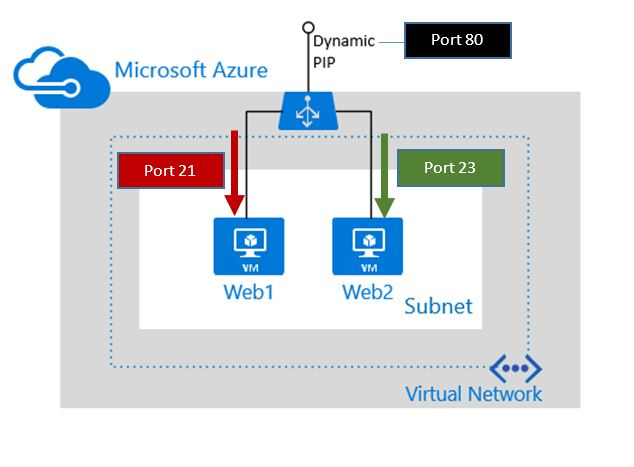

# Getting Started with Azure Resource Manager for load balancers in Node.js

This sample shows how to manage a load balancer using the Azure Resource Manager APIs for Node.js.

You can use a load balancer to provide high availability for your workloads in Azure. An Azure load balancer is a Layer-4 (TCP, UDP) type load balancer that distributes incoming traffic among healthy service instances in cloud services or virtual machines defined in a load balancer set.

For a detailed overview of Azure load balancers, see [Azure Load Balancer overview](https://azure.microsoft.com/documentation/articles/load-balancer-overview/).

This sample deploys an internet-facing load balancer. It then creates and deploys two Azure virtual machines behind the load balancer. For a detailed overview of internet-facing load balancers, see [Internet-facing load balancer overview](https://azure.microsoft.com/documentation/articles/load-balancer-internet-overview/).

To deploy an internet-facing load balancer, you'll need to create and configure the following objects.

- Front end IP configuration - contains public IP addresses for incoming network traffic. 
- Back end address pool - contains network interfaces (NICs) for the virtual machines to receive network traffic from the load balancer. 
- Load balancing rules - contains rules mapping a public port on the load balancer to port in the back end address pool.
- Inbound NAT rules - contains rules mapping a public port on the load balancer to a port for a specific virtual machine in the back end address pool.
- Probes - contains health probes used to check availability of virtual machines instances in the back end address pool.

You can get more information about load balancer components with Azure resource manager at [Azure Resource Manager support for Load Balancer](https://azure.microsoft.com/documentation/articles/load-balancer-arm/).

## Tasks performed in this sample

The sample performs the following tasks to create the load balancer and the load-balanced virtual machines: 

1. Create a ResourceGroup
1. Create a Vnet
1. Create a subnet
1. Create a public IP
1. Build the load balancer payload
	1. Build a front-end IP pool
	1. Build a back-end address pool
	1. Build a health probe
	1. Build a load balancer rule
	1. Build inbound NAT rule 1
	1. Build inbound NAT rule 2
1. Create the load balancer with the above payload
1. Create NIC 1
1. Create NIC 2
1. Find an Ubutnu VM image
1. Create an availability set
1. Create the first VM: Web1
1. Create the second VM: Web2
13. Delete the resource group and the resources created in the previous steps

## Run this sample

1. If you don't already have a Microsoft Azure subscription, you can register for a [free trial account](http://go.microsoft.com/fwlink/?LinkId=330212).

1. Install [node.js](https://nodejs.org) if you haven't already.

2. Clone the sample repository.
    
    	git clone https://github.com:Azure-Samples/app-service-web-nodejs-manage.git

3. Install the dependencies.
    
	    cd network-node-manage-loadbalancer
	    npm install    

4. Create an Azure service principal, using 
    [Azure CLI](https://azure.microsoft.com/documentation/articles/resource-group-authenticate-service-principal-cli/),
    [PowerShell](https://azure.microsoft.com/documentation/articles/resource-group-authenticate-service-principal/)
    or [Azure Portal](https://azure.microsoft.com/documentation/articles/resource-group-create-service-principal-portal/).

5. Set the following environment variables using the information from the service principle that you created.
    
	    export AZURE_SUBSCRIPION_ID={your subscription ID}
	    export CLIENT_ID={your client ID}
	    export APPLICATION_SECRET={your client secret}
	    export DOMAIN={your tenant ID as a guid OR the domain name of your org <contosocorp.com>}
    
    > [AZURE.NOTE] On Windows, use `set` instead of `export`.

6. Run the sample.

	    node index.js   

7. To clean up after index.js, run the cleanup script.
    
	    node cleanup.js <resourceGroupName>

## More information

- [Azure SDK for Node.js](https://github.com/Azure/azure-sdk-for-node)
- [Azure Load Balancer overview](https://azure.microsoft.com/documentation/articles/load-balancer-overview/)

